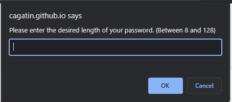
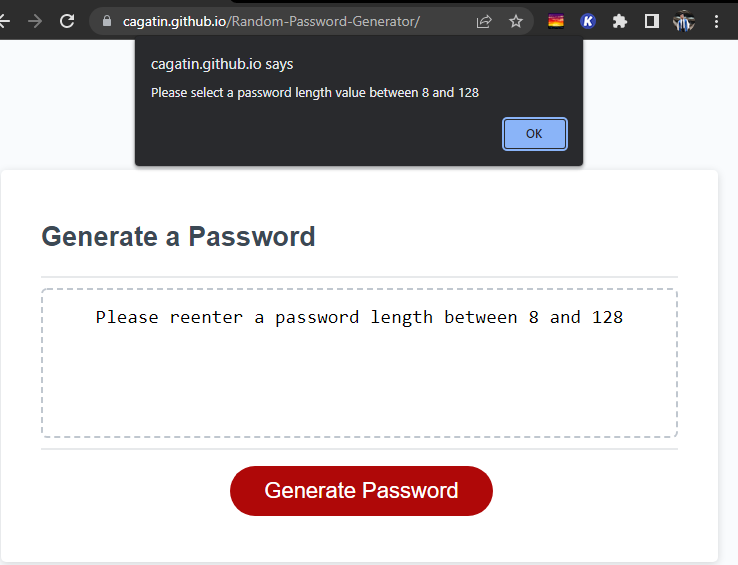
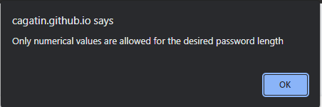
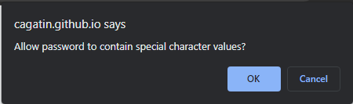

# Random-Password-Generator

## What does this do?
Given a set of decisions based on the user, clicking the red 'Generate Password' button will display a randomly generated password onto the screen. 

The user can select the following choices to include into their randomly generated password:  
    - the addition of special characters (e.g. @#!&%).  
    - the addition of number values (e.g. 1234).  
    - the addition of uppercase characters (e.g. ABCD).  
    - the addition of lowercase characters (e.g. abcd).  

### How are the random passwords Generated?
Random passwords are generated based on the criteria selected by the user. Given a set of prompts, the user selects what type of characters to include in the generated password.

The password is then created through random number generation, where an index value is chosen at random, then selected from a string contianing all possible character values. 

#### First, the user is asked the desired length of the password:
;

The selected password length *must* fall within a range between 8 and 128 characters. If the user selects a number value not within this range, an alert will be given to the user suggesting a proper password length.

;

If the user input contians any non-numbers, an alert will be given to the user suggesting to use only numberical values for the password length.

;

#### Then, the user is given the following prompts to select the criteria for their password:
The addition of special character values:
;